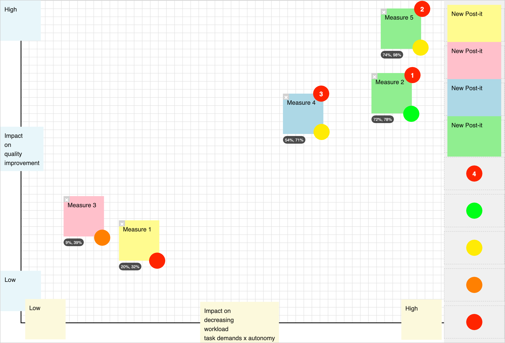

# Whiteboard App

The **Whiteboard App** is an interactive, client‑side canvas built with HTML, CSS, and JavaScript. It allows you to create, move, and customize visual elements in real time—all with an intuitive drag‑and‑drop interface.

## Features

### Post-it Notes
- **Drag and Drop:**  
  Easily drag colorful Post-it notes from the dock onto the whiteboard canvas.
- **Dock Replacement:**  
  The right‑hand dock features four ready‑made Post-it notes (yellow, pink, blue, and green). When you drag one out, a new Post-it of the same color is automatically generated in its place.
- **Dynamic Positioning:**  
  Each used Post-it displays a **position pill** that updates in real time to show its relative position (in percentages) on the grid.
- **Interactive Axes:**  
  When a Post-it is dragged over the x‑ or y‑axis, its background color changes. This behavior can be used to annotate or mark the axes.
- **Easy Deletion:**  
  A small **delete icon** (“×”) appears in the top left of each Post-it (except when over an axis) so you can remove notes with a click.

### Stickers (New!)
- **New Sticker Functionality:**  
  In addition to Post-it notes, the dock now includes a **sticker** slot.
- **Numbered Stickers:**  
  The sticker appears with a unique number. Dragging it from the dock onto the canvas reassigns it as a fully draggable element.
- **Auto-replacement:**  
  Once a sticker is moved to the board, a new sticker with an incremented number is automatically generated in the dock.
- **Always on Top:**  
  Stickers have a high z‑index, ensuring they remain visible above all Post-it notes and other elements.

### Background Customization
- **Upload Background:**  
  Replace the default grid by clicking the **Upload Background** button. Select an image file to personalize your whiteboard.

### Save as PNG
- **Capture Your Work:**  
  Click the **Save as PNG** button to capture the entire whiteboard—including Post-its, stickers, and your custom background—as a high‑quality PNG image.

### Enhanced Interactivity & Performance
- **Touch & Mouse Support:**  
  Enjoy smooth drag‑and‑drop interactions on both desktop and mobile devices.
- **Refactored Drag Manager:**  
  The code now uses a centralized drag manager that optimizes event handling and improves overall performance, making the app more responsive and easier to maintain.

## Demo

Try it out [here](https://businessdatasolutions.github.io/whiteboard/)

## How to Use

1. **Clone the Repository:**

2. **Open the App:**

   Simply open the `index.html` file in your preferred web browser (Chrome, Firefox, etc.). The app runs entirely on the client side—no server setup is required.

3. **Using the App:**

   - **Post-it Notes:**  
     Drag a Post-it from the right‑hand dock onto the canvas. Click inside the Post-it to edit its content, and watch the position pill update automatically. To delete a Post-it, click the "×" icon.

   - **Stickers:**  
     Drag the numbered sticker from the dock onto the canvas. Once placed, the sticker can be moved freely and always stays on top of other elements. A new sticker will instantly replace the one you dragged.

   - **Axes & Grid:**  
     When a Post-it is moved over an axis, it changes color and the position pill (along with the delete icon) temporarily hides. This feature is useful for labeling axes.

   - **Upload Background:**  
     Click the **Upload Background** button, select an image file, and the whiteboard’s background will change from the grid to your chosen image.

   - **Save as PNG:**  
     When you’re ready to save your work, click the **Save as PNG** button. The whiteboard will be captured as a PNG image that you can download and share.

## Technologies Used

- **HTML5** for structure
- **CSS3** for styling (with Materialize CSS for a modern design)
- **Vanilla JavaScript** for interactivity
- **html2canvas** for capturing the whiteboard as a PNG image

## License

This project is licensed under the MIT License. See the [LICENSE](LICENSE) file for details.

## Contributing

Contributions are welcome! If you have ideas, improvements, or new features, please open an issue or submit a pull request.

## Acknowledgments

- [Materialize CSS](https://materializecss.com/) for the styling framework.
- [html2canvas](https://html2canvas.hertzen.com/) for enabling PNG export.
